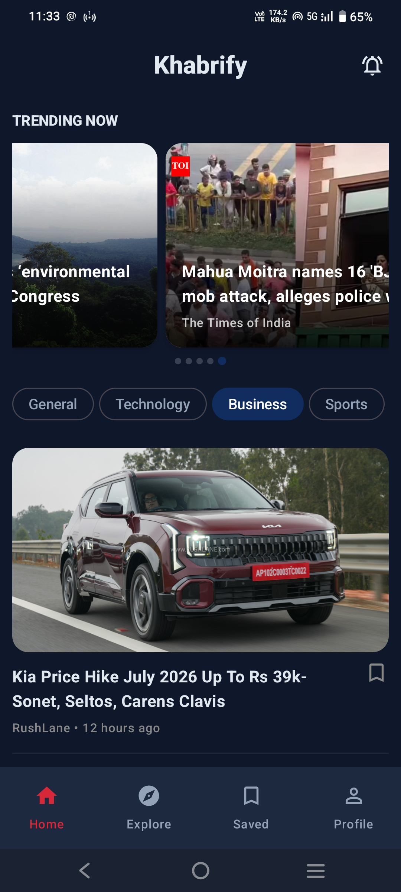
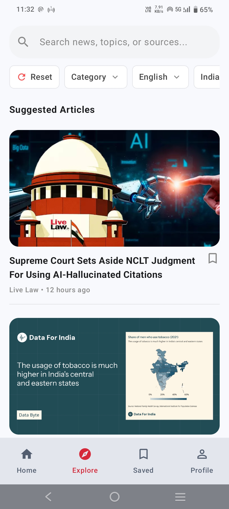
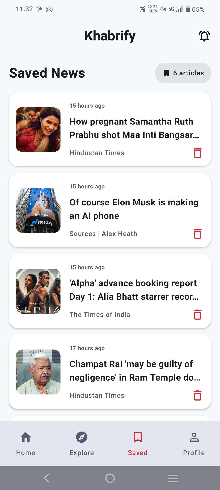
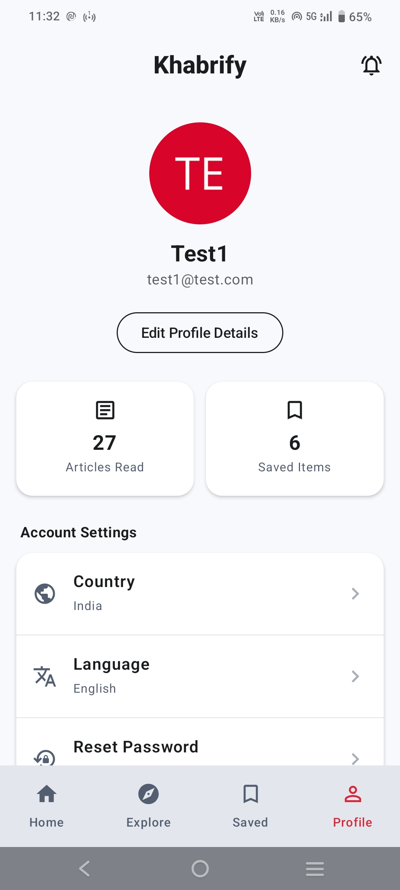
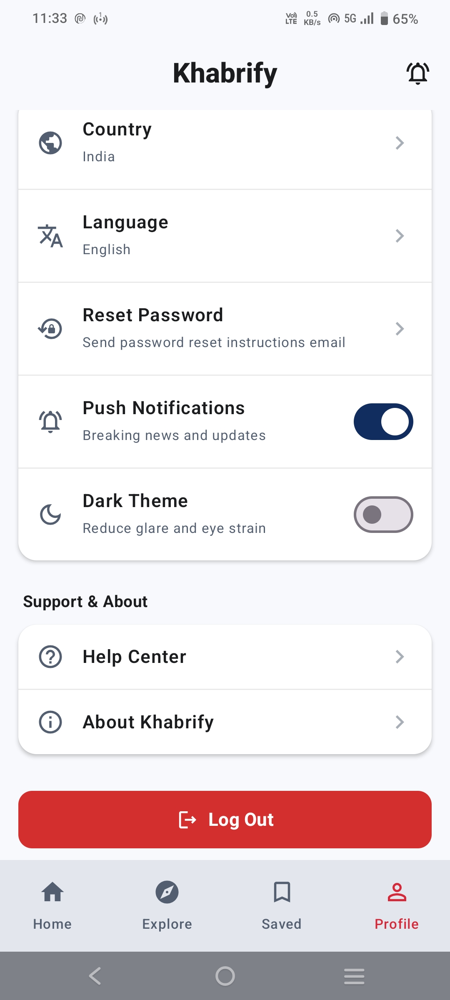

# Khabrify

Khabrify is a modern, feature rich Android news application designed to deliver real time news alerts and a seamless reading experience. Built with a focus on performance and clean architecture, it leverages the latest Android development tools.

## 🚀 Key Features
* **Real-time Notifications:** Integrated Firebase Cloud Messaging (FCM) to push breaking news alerts instantly.
* **Search & Explore:** Allows users to discover new content through categorized news feeds and dynamic search functionality.
* **Offline Access:** Local Room Database caching ensures articles remain accessible even without an active internet connection.
* **Responsive UI:** Built entirely with Jetpack Compose for a fluid, native, and modern interface.
* **Dynamic Theme Support:** Fully responsive UI built with Jetpack Compose that seamlessly adapts to both Light and Dark system themes.
* **Dynamic Content:** Fetches latest news via GNews API with secure backend handling.
* **User-Centric Experience:** Clean, intuitive navigation with built-in feedback and support mechanisms.

## 🛠 Tech Stack
* **Language:** Kotlin
* **UI:** Jetpack Compose (Modern Declarative UI)
* **Architecture:** MVVM (Model-View-ViewModel)
* **Dependency Injection:** Hilt
* **Database:** Room (Persistence Library)
* **Networking:** Retrofit + GNews API
* **Image Loading:** Coil (Image Loading Library)
* **Backend/Services:** Firebase (Auth, Firestore, Cloud Messaging)
* **Asynchronous Programming:** Kotlin Coroutines & Flow
* **Navigation:** Jetpack Navigation Compose

## 🏗 Architecture
Khabrify follows the official Android recommended architecture guidelines utilizing the **MVVM (Model-View-ViewModel)** pattern. It strictly separates concerns to ensure the codebase is highly scalable and testable:
* **Presentation Layer:** Fully declarative UI built with Jetpack Compose, observing state reactively from ViewModels via Kotlin StateFlows.
* **Data Layer:** Implements the Repository Pattern to act as a single source of truth. It smartly coordinates remote data fetching (Retrofit/GNews) and local offline caching (Room Database).
* **Dependency Injection:** Dagger-Hilt is integrated throughout the application to keep components decoupled and easily testable.

## 📸 App Screenshots

|                Home (Light)                |               Home (Dark)                |               Explore                |
|:------------------------------------------:|:----------------------------------------:|:------------------------------------:|
|  |  |  |

|              Saved               |                Profile (Top)                 |                  Profile (Bottom)                  |
|:--------------------------------:|:--------------------------------------------:|:--------------------------------------------------:|
|  |  |  |

## 📧 Contact & Support
If you have any questions, feedback, or bug reports, feel free to contact the developer:
* **Email:** [khabrify@gmail.com](mailto:khabrify@gmail.com)
* **Developer Email:** [prateek.jha2320@gmail.com](mailto:prateek.jha2320@gmail.com)
---
*Built by Prateek Anand.*  